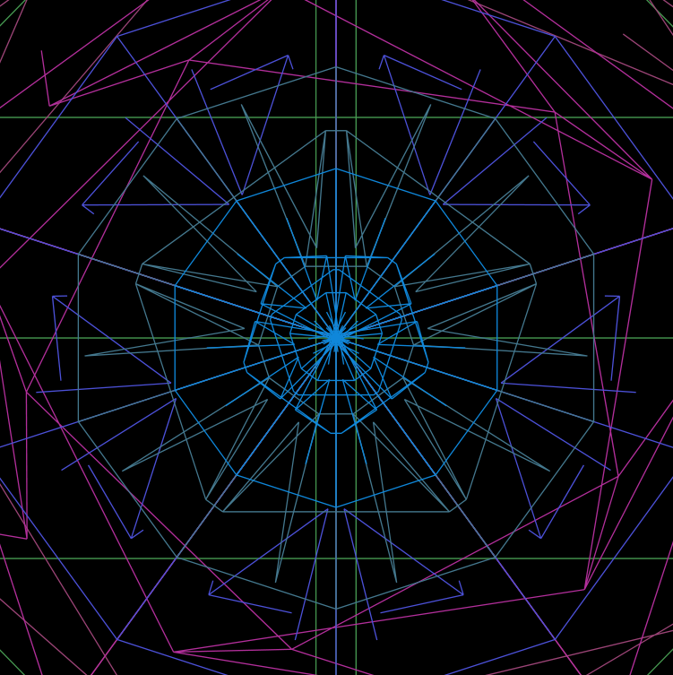

# TRIPBOT9000

TRIPBBOT9000 generates abstract geometric art.
[Get the merchandise](https://tripbot.shop)

## Installation
```
go get -u github.com/0x0f0f0f/tripbot9000
```

## Usage
```
Usage of tripbot9000:
  -combo
    	both mandelbrot and geometric
  -dpi int
    	resolution in dpi (default 120)
  -h string
    	image height (default "80cm")
  -mandel
    	draw a mandelbrot fractal
  -o string
    	output image file name or directory (default "output-Jul-12-2020-17-26-52.png")
  -s int
    	random seed (default 1594567612580521629)
  -w string
    	image width (default "80cm")
```

## Gallery

See [here](https://imgur.com/a/k0CgYWU)

# <p align="center"></p>
# <p align="center"></p>

